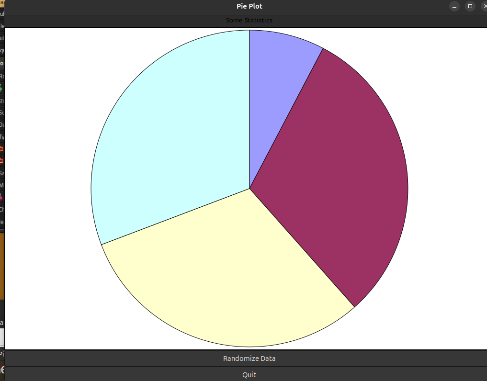
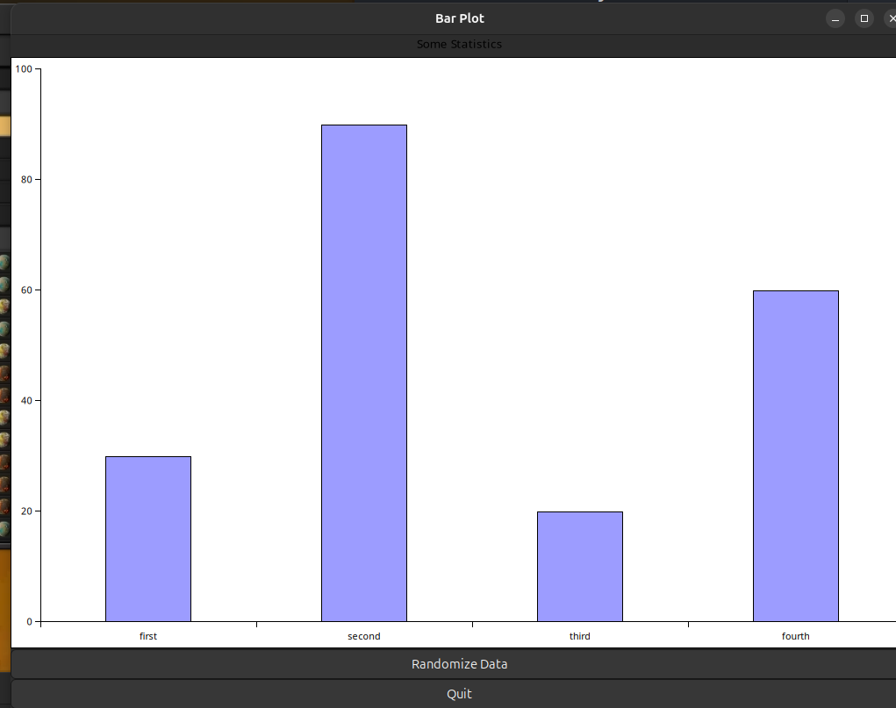

= GOffice bindings for Raku =

This project provides bindings for LibGOffice for use by the Raku
progamming language. Given that this document is a quick knock-off,
the only other thing that can (poorly) describe what this does is
... well ... a couple of pictures.





And, as always....code is good!

```raku
use v6.c;

use GOffice::Raw::Types;
use GTK::Raw::Stock;

use GTK::Application;
use GTK::Box;
use GTK::Button;
use GTK::Separator;

my $app = GTK::Application.new(
  id     => 'org.genex.goffice.chart',
  width  => 1024,
  height => 768
);

use GOffice::Main;
use GOffice::Graph::Label;
use GOffice::Graph::Plot;
use GOffice::Graph::Widget;

class X::ByadPlot is Exception {
  method message { 'Unknown Plot Type' }
}

sub MAIN ( :$bar, :$pie is copy ) {
  $pie //= True unless $bar;

  $app.activate.tap: SUB {
    CATCH {
      when X::ByadPlot {
        say .message;
        exit;
      }

      default {
        .rethrow;
      }
    }

    my $box   = GTK::Box.new-vbox;
    my $sep   = GTK::Separator.new( :h );
    my $btn   = GTK::Button.new-from-stock(GTK_STOCK_QUIT);
    my $rng   = GTK::Button.new-with-label('Randomize Data');
    my $gw    = GOffice::Graph::Widget.new;

    my $graph = $gw.get-graph;
    my $chart = $gw.get-chart;

    my $wn;
    my $pn    = do {
      when $bar.so { $wn = 'Bar Plot'; 'GogDropBarPlot' }
      when $pie.so { $wn = 'Pie Plot'; 'GogPiePlot'     }

      default {
        X::ByadPlot.new.throw;
      }
    }

    say $pn;

    my $plot   = GOffice::Graph::Plot.new-by-name($pn)
      or
    die 'Plot did not initialize!';

    my $s     = $plot.new-series;
    my $l     = GOffice::Graph::Label.new(
      "Some Statistics",
      font-desc => "Sans bold 32",
      :copy
    );

    $s.set-dim( :labels, <first second third fourth> );

    sub randomize {
      my $data = ( 10 * (^10).pick ) xx 4;
      if $pie {
        $s.set-dim(:data, $data);
      } else {
        $s.set-dim(1, 0 xx $data.elems);
        $s.set-dim(2, $data);
      }
    }

    randomize;
    $rng.clicked.tap: SUB { randomize };

    $graph.add-by-name('Title', $l);
    $chart.add-by-name('Plot', $plot);

    $btn.clicked.tap: SUB { $app.quit( :gio ) }

    $box.push: $_, :end for $btn, $rng;
    $box.push: $gw, :fill, :expand;
    $box.push: $sep;

    $app.window.title = $wn;
    $app.window.add($box);
    $app.window.show-all;
  }

  $app.run;
}
```

### Build Instructions

Unfortunately, this project is still a work in progress, but if you would like to contribute or at least see what all the fuss is about, please feel free to join in.

First, insure you have all of the native dependencies. These are: Pango, Cairo, GTK+3, and LibGOffice

It's best if you have a Top-Top-Level directory to keep all of the separate project directories. From that directory, execute the following commands:

```
$ cd <top_level_dir>
$ git clone https://github.com/Xliff/p6-Pango.git
$ git clone https://github.com/Xliff/p6-GtkPlus.git
$ git clone https://github.com/Xliff/raku-GOffice.git
$ export P6_GTK_HOME=<top_level_dir>
$ cd raku-GOffice
$ zef install --deps-only
$ scripts/dependency-build.raku
```

Please note that this is a _large_ amount of code, and it will take a while to build. Feel free to contribute system types and compile times!

A more in-depth writeup will be provided at a later date.
